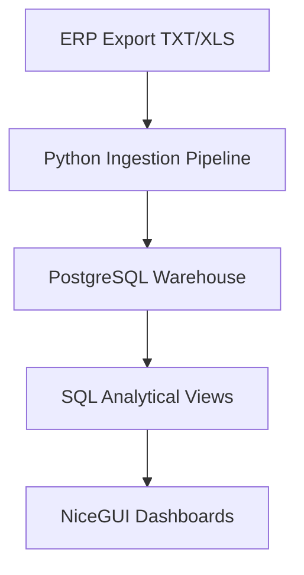

# ABC Debt Management BI

Operational BI system for accounts receivable control.

Production-style analytical pipeline and interactive dashboard for monitoring receivables, overdue debt, payment discipline, and operational collection priorities built with:


---

## Stack

- Python 3.13
- PostgreSQL 16
- SQL analytical views
- NiceGUI
- VPS deployment (Nginx + systemd)
- Responsive UI

---

### 🚀 Live Demo
[Open demo environment](https://demo.maximvenevtsev.com)

---

## Operational Dashboard


---

# 🚀 Business problem

Traditional receivables management often relies on static Excel reports and manual control.

This project transforms raw ERP exports into a structured analytical platform with:

- operational monitoring
- drill-down analytics
- debt prioritization
- overdue control
- upcoming payment visibility
- historical tracking
- parent organization aggregation

---

# 🧠 Core idea

Instead of working with disconnected reports:

TXT / Excel → Python ingestion → PostgreSQL → Analytical SQL Views → Interactive NiceGUI Dashboard

The system provides both:
- operational daily control
- analytical historical visibility

### Data flow



---

# ⚙️ Architecture

## Data ingestion
- Source: Axapta-generated TXT / Excel reports
- Python parsing and normalization
- Validation and transformation layer
- Snapshot-based storage

## Storage
- PostgreSQL database
- Daily historical snapshots
- Fact-based storage model

## Analytics layer
SQL analytical views:

- `v_dashboard_overview`
- `v_branch_summary`
- `v_client_priority`
- `v_client_deltas`
- `v_parent_org_summary`
- `v_parent_org_clients`
- `v_parent_org_invoices`

## Frontend
- NiceGUI
- Interactive operational dashboard
- Drill-down navigation
- Clickable analytical workflow

---

## Key Features

- overdue monitoring
- due-soon payment control
- drill-down client analytics
- parent organization aggregation
- operational prioritization
- risk segmentation
- mobile-friendly UI
- PostgreSQL analytical views

---

# 📊 Implemented features

---

## Dashboard


---


---

Main operational overview:

- Total debt
- Due today
- Due in next 3 days
- Overdue debt
- High-risk clients
- Receivables structure visualization
- Branch-level monitoring
- Interactive filtering

### Receivables structure visualization

Operational debt distribution:

- normal
- due in next 3 days
- due today
- overdue

Designed for fast visual assessment of collection urgency.

---

## Overdue page


---

Focused operational view for problematic receivables.

Features:

- overdue-only client prioritization
- risk segmentation
- action recommendations:
  - CALL NOW
  - CONTROL TODAY
  - REMIND
  - MONITOR
- clickable drill-down to client level

---

## Due today page


---

Operational control of payments expected today.

Features:

- clients requiring attention today
- due-today aggregation
- upcoming payments visibility
- branch filtering
- risk visibility

---

## Due soon page


---

Forward-looking operational monitoring.

Features:

- payments due within next 3 days
- early risk visibility
- proactive collection prioritization
- operational workload planning

---

## Dynamics page


---

Historical delta analysis.

Features:

- debt increase/decrease monitoring
- client-level debt changes
- branch filtering
- sorting and search
- operational change tracking

---

# 👤 Client card


---

PRO-level operational client profile.

Features:

- client summary
- parent organization reference
- branch reference
- KPI cards
- aging structure visualization
- invoice-level drill-down
- overdue highlighting
- due-today highlighting
- upcoming-payment highlighting

Invoice-level details:

- invoice date
- order number
- printable invoice number
- analytics type
- due date
- overdue days
- payment urgency bucket

---

# 🏢 Parent organization card


---

Aggregated monitoring for related legal entities inside one parent structure.

Features:

- consolidated debt overview
- cross-client risk visibility
- branch-level filtering
- organization-level KPI aggregation
- consolidated aging analysis
- consolidated invoice drill-down

This layer models real-world enterprise receivables workflows.

---

# 🔄 Navigation workflow

Dashboard
    ↓
Overdue / Due Today / Due Soon / Dynamics
    ↓
Client Card
    ↓
Parent Organization Card
    ↓
Invoice-level drill-down

---

# 📈 Aging analysis

Debt is segmented into operational buckets:

- Not overdue
- Due in next 3 days
- Due today
- 1–7 overdue days
- 8–30 overdue days
- 31+ overdue days

Used for:
- operational prioritization
- risk visualization
- collection management

---

# ⚙️ Engineering Challenges

This project was designed not as a static dashboard, but as a production-style operational analytics platform.

Key engineering tasks included:

- parsing and normalizing inconsistent ERP TXT/XLS exports
- building reusable PostgreSQL analytical views
- implementing hierarchical parent-organization aggregation
- creating drill-down analytical workflows
- separating operational and analytical logic
- deploying a production-like demo environment on VPS
- configuring Nginx + HTTPS + systemd service
- optimizing UI for both desktop and mobile devices

# ▶️ How to run

```bash
python -m src.app.main
```

Open in browser:

```text
http://localhost:8080
```

---

# 🔮 Future roadmap

See:

```text
docs/FUTURE_ROADMAP.md
```

Planned features include:

- payment discipline rating
- behavioral risk analytics
- branch cards
- trend visualization
- credit limit monitoring
- CRM-like collection workflow
- multi-currency support
- forecasting models

---

# ⚠️ Current status

Current version is an operational MVP intended for:

- controlled demo
- workflow validation
- business feedback
- architecture demonstration

Production hardening still planned:

- authentication
- scheduled ETL
- backup strategy
- deployment automation
- user management

---

# 🧪 Demo dataset

Sanitized demo datasets can be generated from normalized PostgreSQL views using:

```bash
python tools/export_demo_dataset.py
```
