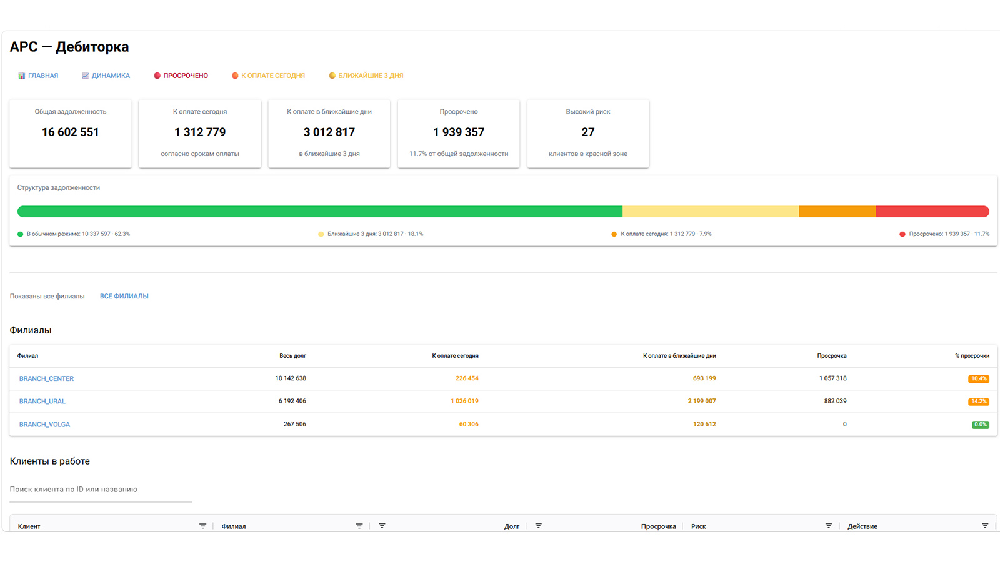
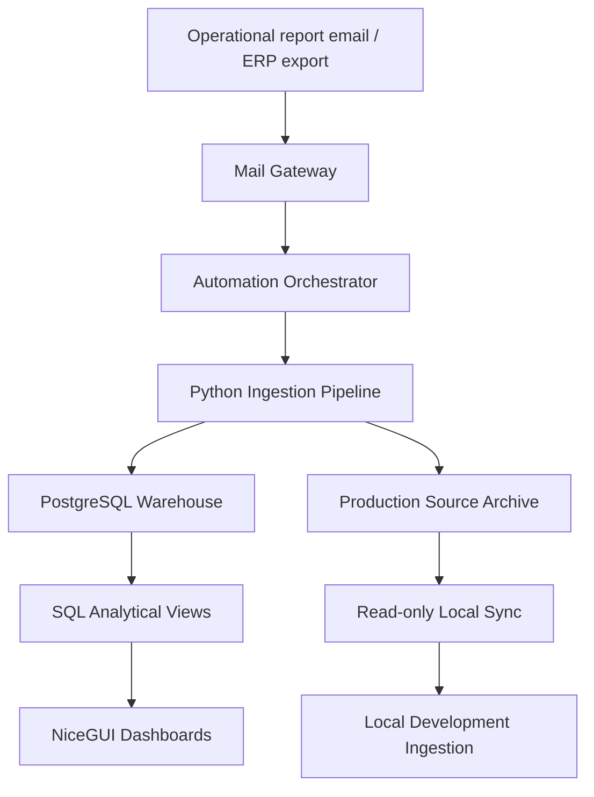
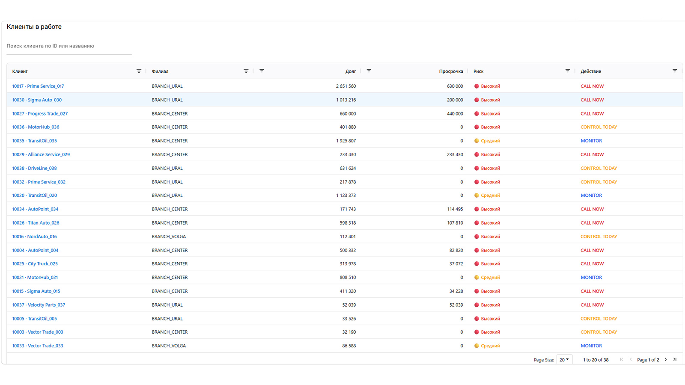
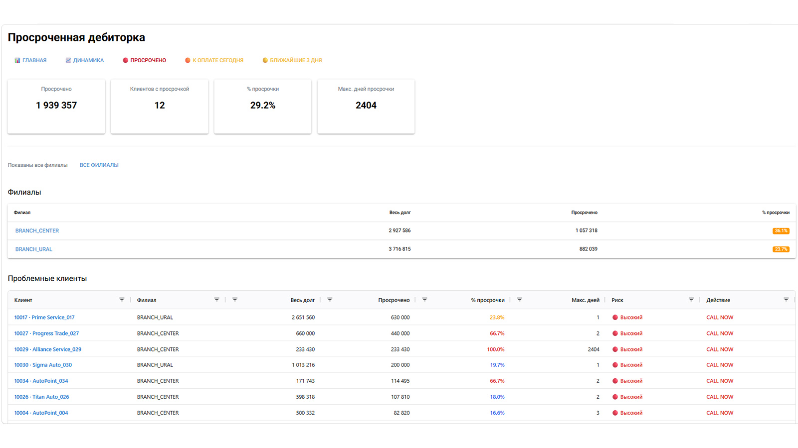
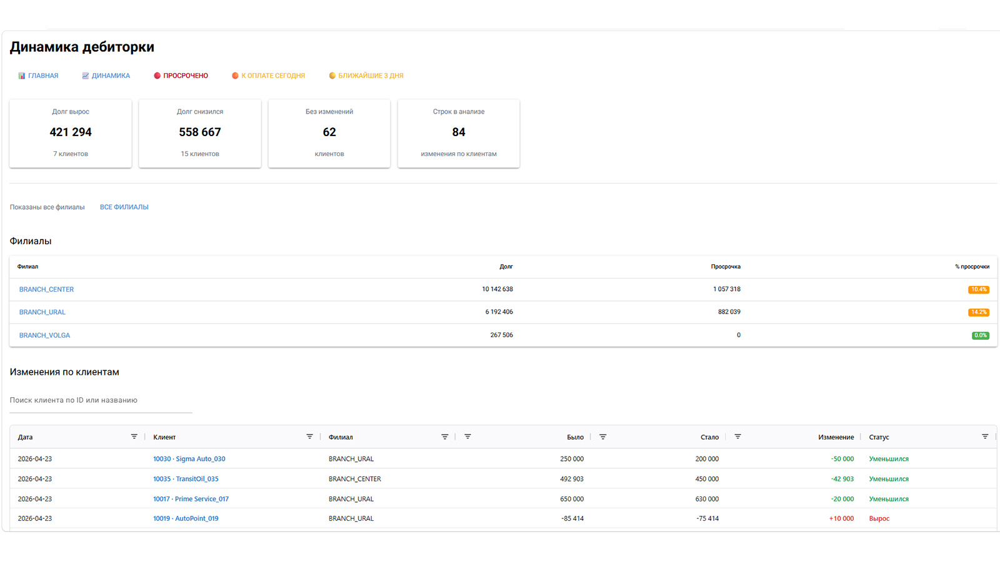
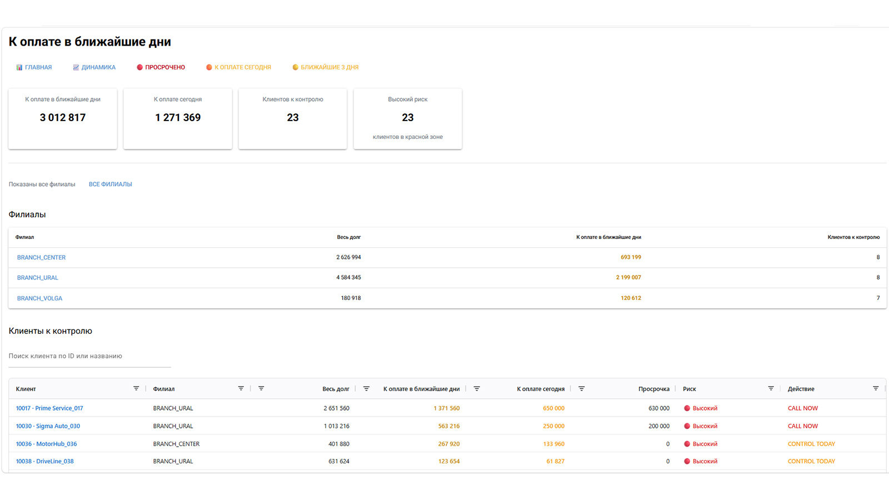
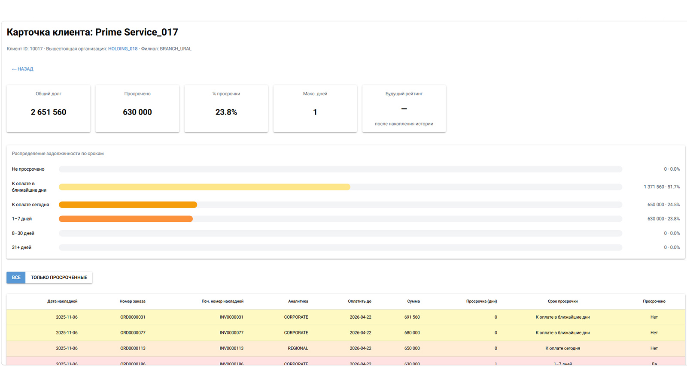
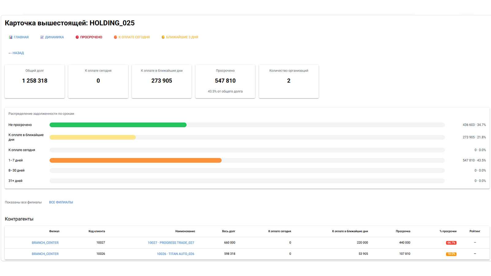

# ABC Debt Management BI

Operational BI system for accounts receivable control.

Production-style analytical pipeline and interactive dashboard for monitoring receivables, overdue debt, payment discipline, and operational collection priorities built with:


---

## Stack

- Python 3.13
- PostgreSQL 16
- SQL analytical views
- NiceGUI
- VPS deployment (Nginx + systemd)
- scheduled production ingestion
- secure read-only production-to-development synchronization
- Responsive UI

---

### 🚀 Live Demo
[Open demo environment](https://demo.maximvenevtsev.com)

---

## Operational Dashboard



---

# 🚀 Business problem

Traditional receivables management often relies on static Excel reports and manual control.

This project transforms raw ERP exports into a structured analytical platform with:

- operational monitoring
- drill-down analytics
- debt prioritization
- overdue control
- upcoming payment visibility
- historical tracking
- parent organization aggregation
- executive-level portfolio monitoring
- hidden risk detection inside non-overdue receivables

---

# 🧠 Core idea

Instead of working with disconnected reports:

TXT / Excel → Python ingestion → PostgreSQL → Analytical SQL Views → Interactive NiceGUI Dashboard

The system provides both:
- operational daily control
- analytical historical visibility

### Data flow



---

# ⚙️ Architecture

## Data ingestion
- Source: Axapta-generated TXT / Excel reports
- Automated Mail Gateway for report attachment pickup
- scheduled Automation Orchestrator for safe handoff into production ingestion
- restart-safe Local Sync from the production source archive
- SHA256 content identity and duplicate protection
- atomic staging and raw-directory handoff
- Python parsing and normalization
- Validation and transformation layer
- Snapshot-based storage
- isolated, transaction-safe historical reconstruction with dry-run validation

## Storage
- PostgreSQL database
- Daily historical snapshots
- Fact-based storage model

## Analytics layer
SQL analytical views:

- `v_dashboard_overview`
- `v_branch_summary`
- `v_client_priority`
- `v_client_deltas`
- `v_parent_org_summary`
- `v_parent_org_clients`
- `v_parent_org_invoices`
- `v_client_rating_base`
- `v_client_rating`
- `v_client_rating_history`
- `v_client_rating_dynamics`
- `v_client_rating_latest_dynamics`
- `v_client_rating_change_events`
- `v_parent_org_rating_dynamics`
- `v_branch_rating_dynamics`
- `v_client_daily_history`
- `v_parent_org_daily_history`
- `v_branch_daily_history`
- `v_executive_overview_kpi`
- `v_executive_portfolio_daily_history`
- `v_executive_green_debt_maturity_history`
- `v_executive_payment_term_history`
- `v_executive_long_green_exposure`
- `v_executive_rating_exposure`
- `v_executive_branch_health`
- `v_executive_long_green_clients`
- `v_executive_long_green_invoices`
- `v_executive_overdue_clients`
- `v_executive_hidden_risk_clients`

## Frontend
- NiceGUI
- Interactive operational dashboard
- Drill-down navigation
- Clickable analytical workflow
- Reusable frontend UI components

Reusable frontend components:
- branch_filter
- aging_bar
- navigation
- rating_stars
- charts
- kpi_cards
- behavioral_indicators
- rating_dynamics
- green_debt_maturity

---

## Key Features

- overdue monitoring
- due-soon payment control
- drill-down client analytics
- parent organization aggregation
- operational prioritization
- risk segmentation
- mobile-friendly UI
- PostgreSQL analytical views
- configurable client payment discipline rating
- colored rating stars across operational views
- YAML-driven business rules
- incremental real-data ingestion workflow
- isolated demo / work environment separation
- reusable branch filtering component
- multi-select branch filtering
- synchronized KPI recalculation
- reusable frontend UI components

- historical client / parent organization / branch analytics
- reactive historical period filter: 28 / 90 / 180 / all
- behavioral interpretation indicators
- branch analytics card with drill-down navigation
- client rating history snapshots
- client rating dynamics strip
- parent organization weighted portfolio rating
- branch weighted portfolio rating
- executive overview dashboard
- executive drill-down pages for management signals
- green debt maturity monitoring
- hidden-risk client detection
- branch risk profile analysis
- automated Mail Gateway
- scheduled production ingestion orchestration
- restart-safe production-to-development Local Sync
- SHA256 content-hash duplicate protection
- isolated production, local development, and public demo environments
- end-to-end validated production data pipeline

---

# 📊 Implemented features

---

## Dashboard


Additional implemented UX features:

- multi-select branch filtering
- synchronized KPI recalculation
- synchronized aging-bar updates
- reusable filtering component architecture
- unified filtering behavior across operational pages

---



---

Main operational overview:

- Total debt
- Due today
- Due in next 3 days
- Overdue debt
- High-risk clients
- Receivables structure visualization
- Branch-level monitoring
- Interactive filtering

### Receivables structure visualization

Operational debt distribution:

- normal
- due in next 3 days
- due today
- overdue

Designed for fast visual assessment of collection urgency.

---

## Overdue page



---

Focused operational view for problematic receivables.

Features:

- overdue-only client prioritization
- risk segmentation
- action recommendations:
  - CALL NOW
  - CONTROL TODAY
  - REMIND
  - MONITOR
- clickable drill-down to client level

---

## Due today page



---

Operational control of payments expected today.

Features:

- clients requiring attention today
- due-today aggregation
- upcoming payments visibility
- branch filtering
- risk visibility

---

## Due soon page



---

Forward-looking operational monitoring.

Features:

- payments due within next 3 days
- early risk visibility
- proactive collection prioritization
- operational workload planning

---

## Dynamics page


---

Historical delta analysis.

Features:

- debt increase/decrease monitoring
- client-level debt changes
- branch filtering
- sorting and search
- operational change tracking

---

# 👤 Client card



---

PRO-level operational client profile.

Features:

- client summary
- parent organization reference
- branch reference
- KPI cards
- aging structure visualization
- invoice-level drill-down
- overdue highlighting
- due-today highlighting
- upcoming-payment highlighting

Invoice-level details:

- invoice date
- order number
- printable invoice number
- analytics type
- due date
- overdue days
- payment urgency bucket

### Client payment discipline rating

The platform includes a configurable client rating engine based on historical receivables behavior.

Implemented capabilities:

- YAML-based rating rules loaded into PostgreSQL configuration tables
- PostgreSQL analytical rating views
- rolling historical window logic
- confidence levels depending on accumulated history
- colored star rating visualization
- reusable UI component for rating rendering
- rating shown across client cards and operational client tables
- automatic daily rating snapshot creation after ingestion
- client-level rating dynamics strip
- parent-organization and branch-level weighted portfolio rating

The current rating model is designed to evolve as more daily snapshots are accumulated.

---

# 🏢 Parent organization card



---

Aggregated monitoring for related legal entities inside one parent structure.

Features:

- consolidated debt overview
- cross-client risk visibility
- branch-level filtering
- organization-level KPI aggregation
- weighted portfolio rating strip
- portfolio rating dynamics
- consolidated aging analysis
- consolidated invoice drill-down

This layer models real-world enterprise receivables workflows.

---


---

# 📈 Phase 2 — Historical Behavioral Analytics Layer

Phase 2 extends the operational dashboard into a historical behavioral analytics system.

Implemented capabilities:

- historical debt charts for client cards
- historical debt charts for parent organization cards
- historical debt charts for branch cards
- debt structure visualization by day
- reactive period selector: 28 / 90 / 180 / all
- reusable Plotly chart components
- reusable KPI components
- reusable behavioral indicator layer
- historical KPI summaries
- branch-card drill-down from dashboard branch filter

Behavioral indicators currently include:

- debt trend: growing / decreasing / stable
- overdue behavior: absent / episodic / regular
- volatility: stable / moderate / high

Historical analytics are currently available at three hierarchy levels:

```text
Branch
    ↓
Parent Organization
    ↓
Client
```

This turns the dashboard from a current-state operational screen into a hierarchical historical receivables investigation tool.

---

# 🏬 Branch card

Branch-level analytical profile.

Features:

- branch KPI overview
- weighted portfolio rating strip
- portfolio rating dynamics
- branch aging structure
- historical debt trend
- historical debt structure by day
- behavioral interpretation indicators
- client table with rating
- invoice-level drill-down
- navigation to client cards and parent organization cards

# 📊 Phase 3.1 — Rating Dynamics Layer

Phase 3.1 adds a historical rating layer on top of the existing client payment discipline rating.

Implemented capabilities:

- daily client rating snapshot table
- automatic rating snapshot creation after successful ingestion
- client rating dynamics SQL views
- latest rating change detection
- rating change event view
- compact rating dynamics strip on Client Card
- weighted portfolio rating for Parent Organization Card
- weighted portfolio rating for Branch Card
- reusable rating dynamics frontend component

The rating dynamics layer makes it possible to track:

- rating upgrades
- rating downgrades
- stable clients
- newly fixed ratings
- branch-level and parent-organization-level portfolio quality

This creates the foundation for executive portfolio monitoring, downgrade alerts and future predictive risk analytics.

---


# 🧭 Executive Overview Dashboard

Executive Overview adds an owner / management-level layer on top of operational receivables monitoring.

It is designed to answer not only:

```text
How much is overdue?
```

but also:

```text
Where is risk hidden before it becomes overdue?
Which branches create the risk?
Which clients and invoices explain the signal?
```

Implemented capabilities:

- executive KPI cards
- weighted portfolio rating
- executive portfolio status / verdict
- historical total debt and overdue dynamics
- operational debt structure by day
- reliable debt vs debt requiring control
- green debt maturity structure by payment-term buckets
- weighted average payment-term trend
- long green exposure trend: 90+ and 120+ non-overdue debt
- exposure by rating segment
- management signal cards with drill-down navigation

Current management signal drill-down pages:

```text
/executive/long-green
/executive/overdue
/executive/branches
/executive/hidden-risk
```

These pages provide tabular explanations of the signals and support drill-down navigation to client and branch cards.

### Green debt quality logic

The Executive layer separates debt into:

```text
Reliable debt =
4–5 star clients
+ non-overdue debt
+ payment term <= 45 calendar days
```

and:

```text
Debt requiring control =
all remaining receivables
```

This helps detect situations where risk is formally kept inside the “green zone” through unusually long payment terms.

---

# 🔄 Navigation workflow

Dashboard
    ↓
Branch Card
    ↓
Parent Organization Card
    ↓
Client Card
    ↓
Invoice-level drill-down

Executive Overview
    ↓
Management Signal Drill-down
    ↓
Client / Branch Card

---

# 📈 Aging analysis

Debt is segmented into operational buckets:

- Not overdue
- Due in next 3 days
- Due today
- 1–7 overdue days
- 8–30 overdue days
- 31+ overdue days

Used for:
- operational prioritization
- risk visualization
- collection management

---

# ⚙️ Engineering Challenges

This project was designed not as a static dashboard, but as a production-style operational analytics platform.

Key engineering tasks included:

- parsing and normalizing inconsistent ERP TXT/XLS exports
- creating a safe pre-ingestion Mail Gateway
- orchestrating restart-safe file handoff into the ingestion raw directory
- synchronizing the production archive into local development through read-only access
- making interrupted downloads and repeated synchronization safe through atomic publication and content hashes
- building reusable PostgreSQL analytical views
- implementing hierarchical parent-organization aggregation
- creating drill-down analytical workflows
- separating operational and analytical logic
- deploying a production-like demo environment on VPS
- configuring Nginx + HTTPS + systemd service
- optimizing UI for both desktop and mobile devices

---

# ▶️ How to run

```bash
python -m src.app.main
```

Open in browser:

```text
http://localhost:8080
```

---

# 🔮 Future roadmap

See:

```text
docs/FUTURE_ROADMAP.md
```

Planned features include:

- payment discipline rating refinement
- behavioral risk analytics
- term-shift detection for manual payment-date changes
- rating-term bubble matrix
- rating trend visualization
- credit limit monitoring
- CRM-like collection workflow
- multi-currency support
- forecasting models

---

# ⚠️ Current status

Current version has reached **Production Foundation v1** and supports:

- scheduled production report ingestion
- automatic online dashboard refresh
- secure, deliberately manual production-to-development synchronization
- restart-safe recovery after interrupted transfers or ingestion
- separate public demo, production, and local development operations

Further operational maturity still planned:

- automated PostgreSQL backups and restore testing
- monitoring and failure notifications beyond current structured logs
- application-level role-based access control
- operational status visibility
- performance engineering

---

# 🧪 Demo dataset

Sanitized demo datasets can be generated from normalized PostgreSQL views using:

```bash
python tools/export_demo_dataset.py
```


---

# June 2026 release highlights

New operational capabilities:

- Payment Attention page;
- Term Shifts page;
- Branch Table reusable component;
- Recent Paid Invoice analytics;
- Contract Payment Term detection;
- Usual Payment Window monitoring;
- Executive Branch Health enhancements;
- portfolio bucket consistency fixes;
- unified sorting and operational table behavior.

The platform now supports both overdue-risk detection and early identification of non-overdue clients whose payment behavior deviates from their historical norm.
